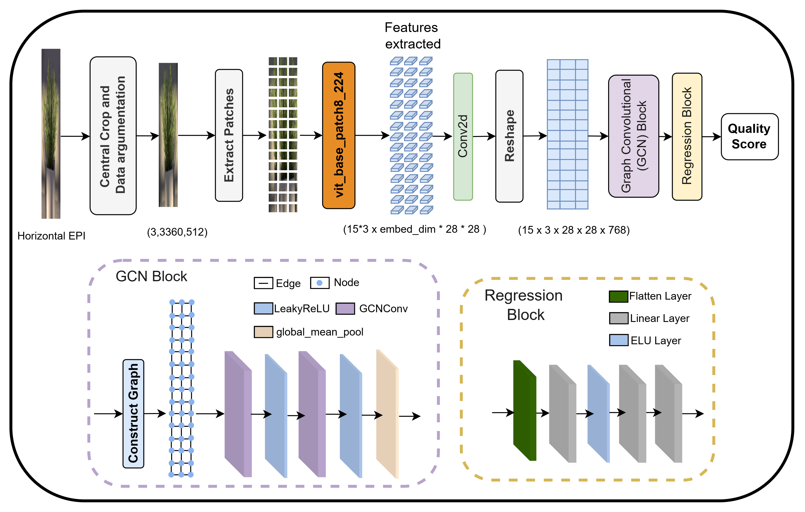

# ViGBLiF

PyTorch code for the paper: "**ViGBLiF: Graph Framework for No-Reference Light Field Image Quality Prediction**". A detailed description of the model and experiments can be found in our paper: [Link].



## Setup

### Requirements
- Python 3.5
- PyTorch (2.5.1)
- torch-geometric (2.6.1)

Additional dependencies can be installed from `requirements.txt`:
  
```
pip install -r requirements.txt 
```

## Generate Dataset

To generate the dataset for training and testing, use the `generate_data.ipynb` file in the `data/` folder. You will need the following input files:

- Light field images (format details in `generate_data.ipynb` ).
- Ground truth labels for the image quality assessment.


## Training
To train the model, use the train.py script:

```
python train.py
```

You can modify the hyperparameters and dataset paths in the configuration file `config.py`.


## Citation
If you use this code in your research, please cite our paper:

Note: The citation will be updated once the paper is published
```
@article{ViGBLiF,
  author = {Author Name, et al.},
  title = {ViGBLiF: Graph Framework for No-Reference Light Field Image Quality Prediction},
  journal = {Journal Name},
  year = {2025},
  url = {Link to paper}
}
```

## License
This project is licensed under the MIT License - see the LICENSE file for details.


